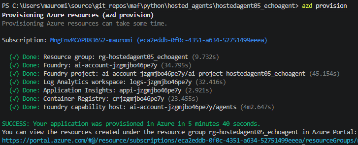
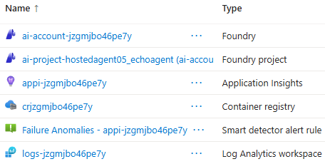
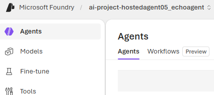
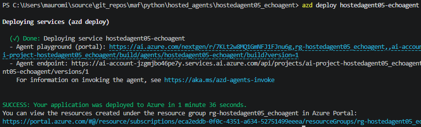
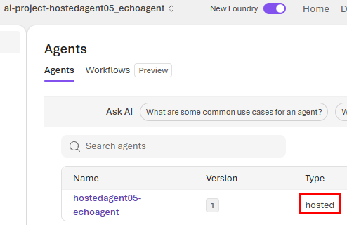
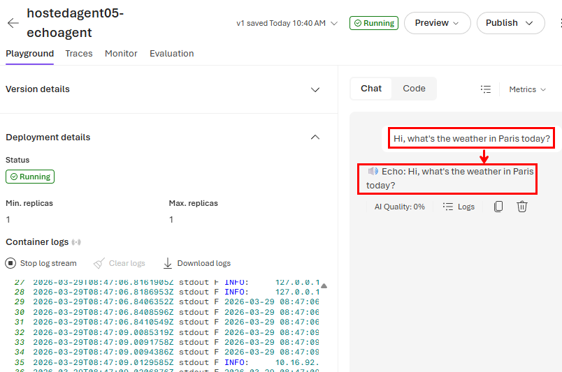
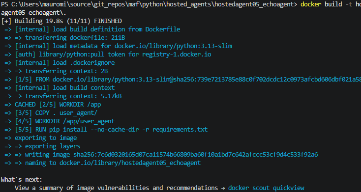
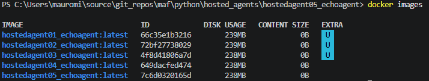
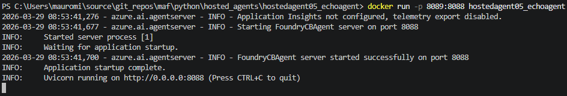

# Guide to Publishing and Testing a Hosted Agent on Microsoft Foundry with azd

## Introduction
This guide provides a concise approach for publishing and testing a hosted agent on Microsoft Foundry using `azd`. Follow these steps to configure, provision, and deploy your agent.

## 1. Environment Setup

1. Create the base folder and cd into it:
   ```bash
   md hostedagent05_echoagent
   cd hostedagent05_echoagent
   ```

2. Initialize the project:<br/>
The **Environment name** in this case will be `hostedagent05_echoagent`. Based on it, Azure will create the corresponding Resource Group: `rg-hostedagent05_echoagent`.

   ```bash
   azd init -t https://github.com/Azure-Samples/azd-ai-starter-basic
   ```

3. Set the environment variables:
   ```bash
   azd env set AIF_STD_PROJECT_ENDPOINT "https://***.services.ai.azure.com/api/projects/***"
   azd env set MODEL_DEPLOYMENT_NAME "gpt-4o"
   ```

## 2. Agent Project

1. Create the `agent` folder in the project root:
   ```bash
   mkdir agent
   ```

2. Copy the following files into that folder:
   - `agent.yaml`
   - `Dockerfile`
   - `main.py`
   - `requirements.txt`

3. Initialize the agent:
   This step will ask you to select:
   - Azure Subscription
   - Azure Region
   - Container resource allocation (CPU and memory):
     - 0.25 cores, 0.5Gi memory
     - 0.5 cores, 1Gi memory
     - 1 core, 2Gi memory
     - 2 cores, 4Gi memory
   ```bash
   azd ai agent init -m agent\agent.yaml
   ```
   As a result, such information is written into `azure.yaml`:
   ```yaml
   # yaml-language-server: $schema=https://raw.githubusercontent.com/Azure/azure-dev/main/schemas/v1.0/azure.yaml.json

   requiredVersions:
      extensions:
         azure.ai.agents: '>=0.1.0-preview'
   name: ai-foundry-starter-basic
   services:
      hostedagent05-echoagent:
         project: src/hostedagent05-echoagent
         host: azure.ai.agent
         language: docker
         docker:
               remoteBuild: true
         config:
               container:
                  resources:
                     cpu: "0.25"
                     memory: 0.5Gi
                  scale:
                     maxReplicas: 1
               startupCommand: python main.py
   infra:
      provider: bicep
      path: ./infra
   ```

## 3. Provision and Deploy

1. Provision the resources with azd:
   ```bash
   azd provision
   ```
   This step provisions six Azure Resources:<br/>   
   <br/>
   - Resource group
   - Foundry
   - Foundry project
   - Log Analytics workspace
   - Application Insights
   - Container Registry<br/>
   <br/>
   , and may take up to 5 minutes.<br/>
   At this point, the foundry project still does not contain any agents: <br/>
   


2. Deploy the agent:
   ```bash
   azd deploy hostedagent05-echoagent
   ```
   This step takes about two minutes:<br/>
   <br/><br/>
   , and adds the hosted agent to the project: <br/>
   <br/><br/>
   , which works and produces logs in the logs stream:<br/>
   

## 4. Local Docker Build and Run

1. Build the Docker image, which takes about 1 minute:
   ```bash
   docker build -t hostedagent05_echoagent .\src\hostedagent05-echoagent\.
   ```
   

2. List Docker images:
   ```bash
   docker images -a
   ```
   

3. Run the Docker container (in this case, we map `external` port 8089 to `internal` 8088):
   ```bash
   docker run -p 8089:8088 hostedagent05_echoagent
   ```
   <br/>
   **Note:** `EXPOSE` in `Dockerfile` is only informational. If your app listens on `8088`, but it is a good practice to change it to the real port that the agent listens on.

### Port mapping meaning

| Host Port | Container Port | Meaning |
|-----------|----------------|---------|
| 8089      | 8088           | When you visit http://localhost:8089, Docker forwards traffic to internal port 8088 |
